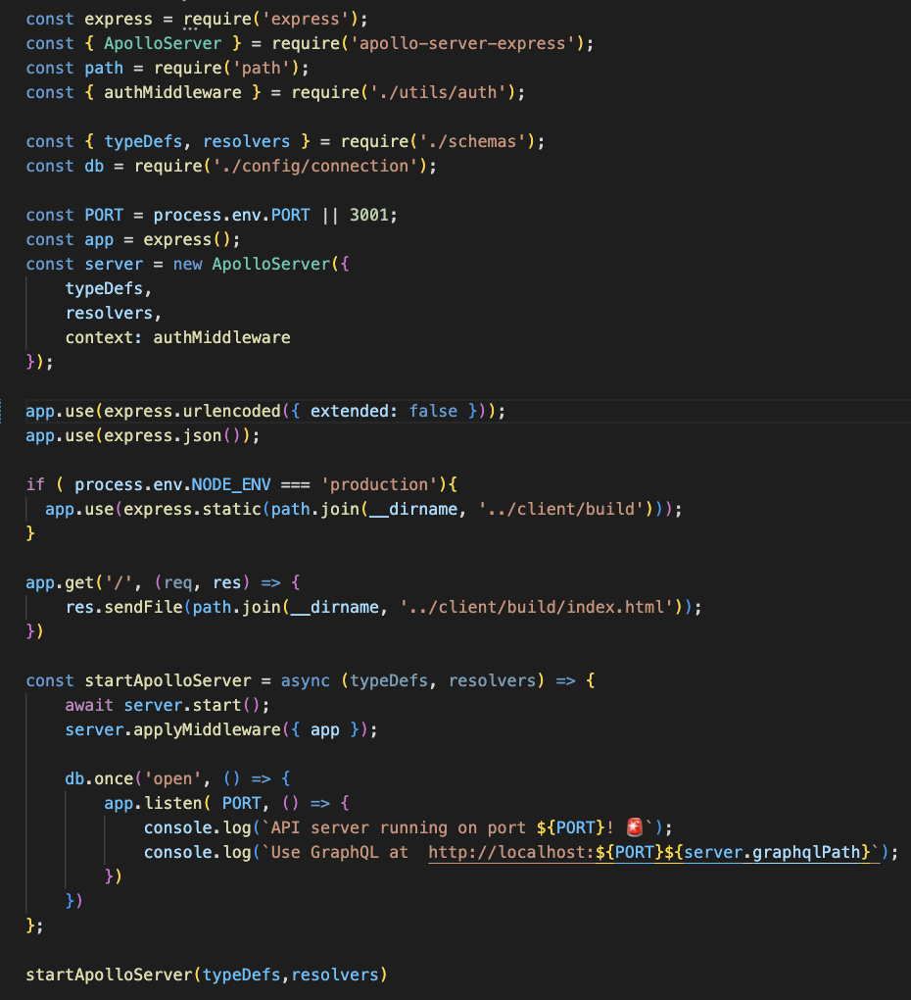
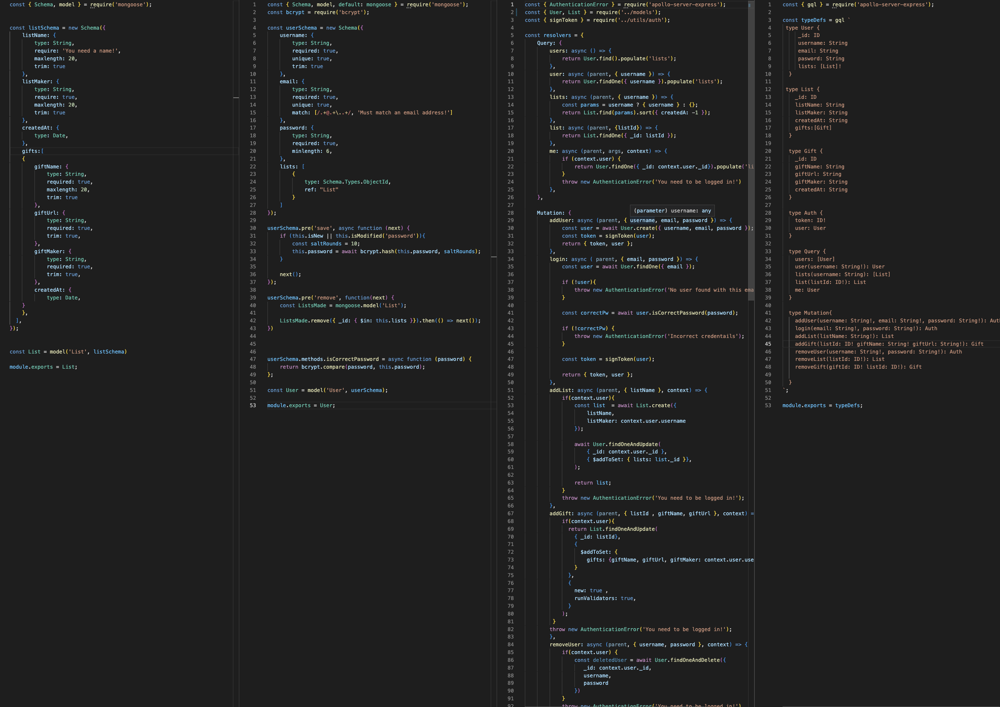
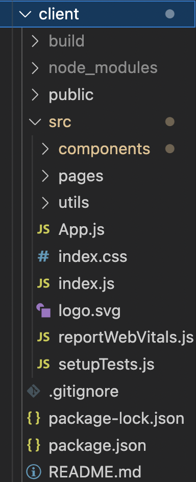
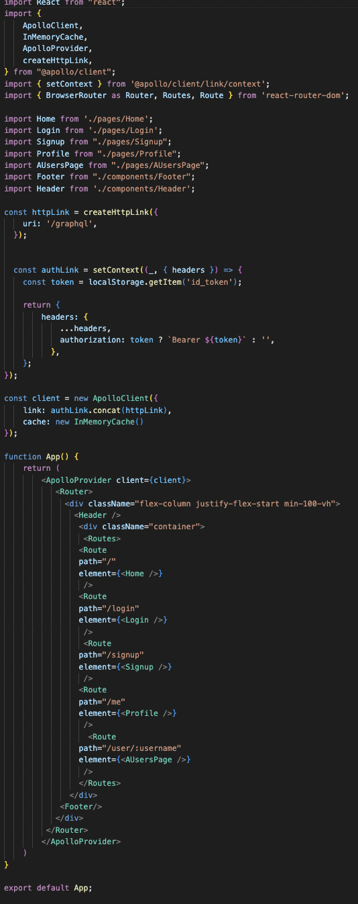
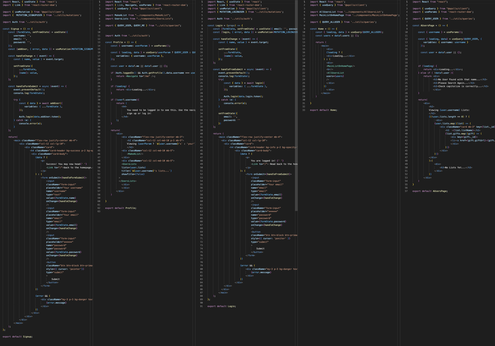
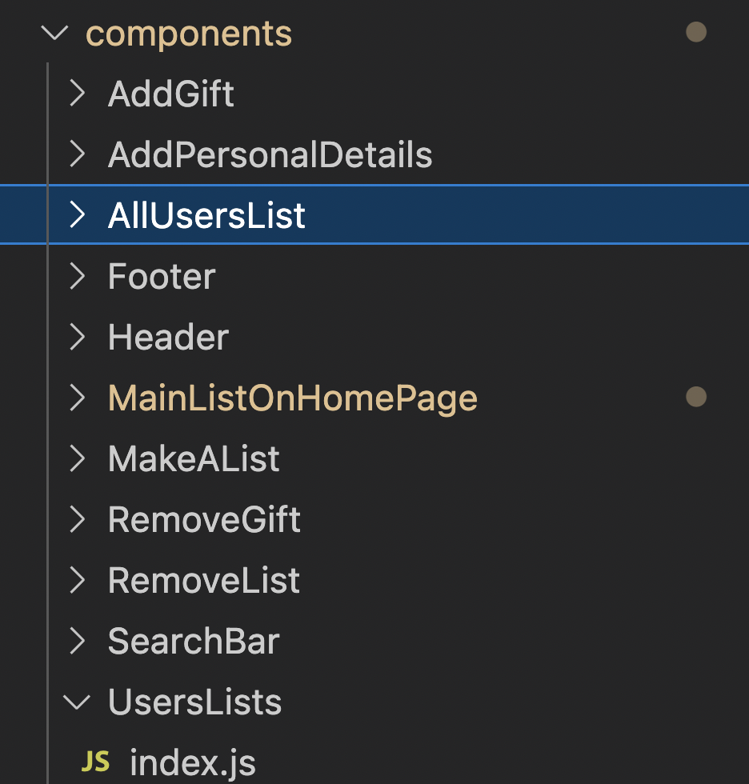

# Listed 
   

### GitHub repo:

https://github.com/JimmySolis/listed

### Website:

https://listed.herokuapp.com/
  ## Description
  In this project I took on the task on creating a website that tracks all of your favorite products and puts them in a list for you to see or share. Eveyone can have access to this list or it can be private in case you are serching for something special for someone.

  ## Table of Contents 
  - [Installation](#installation)
  - [Usage](#usage)

  ## Installation
  There is no need to install anything. All you need to do is follow the link to the website above.

  ## Usage
  In this application you can make a profile and add lists that hold the needed gifts you want. Simply add a name and copy the url from what ever website you want and done! We will display the youts lists to users that want to view them in the website.

  ## Questions
  Here is my email for questions:  jimmysolis14@gmail.com
   
  If you would like to look me up in github, here is my username: JimmySolis
   
  Follow these instructions to contact me:  
  Please email me with any questions.

 ### How it works:

 #### 1) The first half is about the server. In here I have the needed packages declared and used with middleware to have them avalibe throughout my app.

 

 #### 2) Models & Schema | In these files I have the structures for my objects being created.
 

 #### 3) Next is the remaining half. Here is the client responsible for the front end.
 

 ### 4) App.js is where I make connection with graphgl. In here I also have routes to my pages.
 

 ### 5) Here we have all the pages with components.
 

 ### 6) Last here are the components that handel adding and deleting objects in my app.
